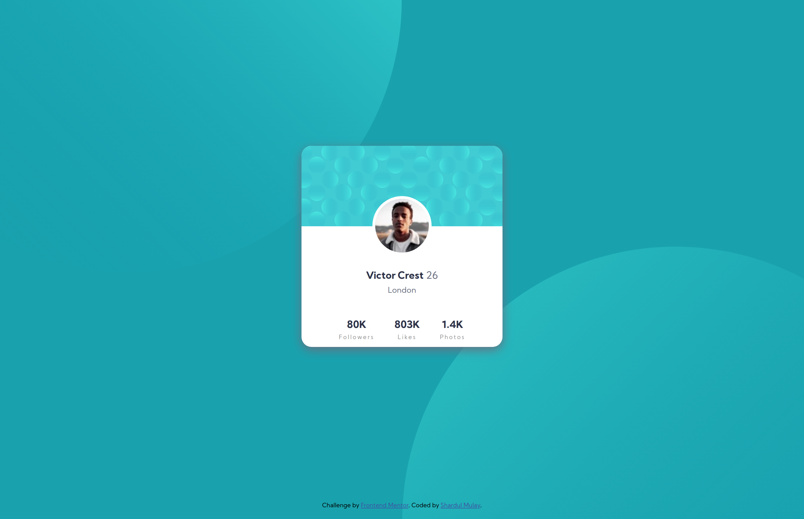
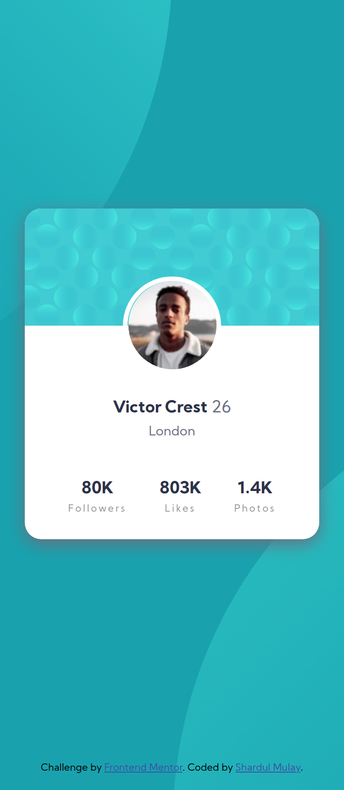

# Frontend Mentor - Profile card component solution

This is a solution to the [Profile card component challenge on Frontend Mentor](https://www.frontendmentor.io/challenges/profile-card-component-cfArpWshJ). Frontend Mentor challenges help you improve your coding skills by building realistic projects. 

## Table of contents

- [Overview](#overview)
  - [The challenge](#the-challenge)
  - [Screenshot](#screenshot)
  - [Links](#links)
- [My process](#my-process)
  - [Built with](#built-with)
  - [What I learned](#what-i-learned)
  - [Continued development](#continued-development)
- [Author](#author)

## Overview

### The challenge

- Build out the project to the designs provided

### Screenshot

### Links

- Solution URL: [Visit solution](https://your-solution-url.com)
- Live Site URL: [Visit live site](https://sh4rdu1-git.github.io/fm-profile-card-component/)

## My process

### Built with

- Semantic HTML5 markup
- CSS custom properties
- Flexbox

### What I learned

I learned basic content alignment and spacing. This was my first experience using rem and vh, vw units.

### Continued development

CSS Flexbox, use of CSS units like rem, vh, vw.

## Author

- GitHub - [Shardul Mulay](https://www.github.com/sh4rdu1-git)
- Frontend Mentor - [@sh4rdu1-git](https://www.frontendmentor.io/profile/sh4rdu1-git)
